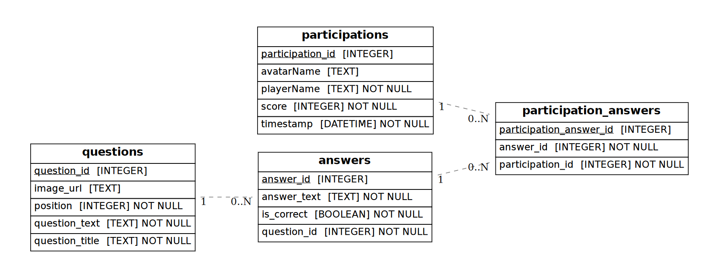

# Notre projet 

Notre projet est quiz dont le thème porte sur le retrogaming !
Nous y avons ajouté de nombreuses fonctionnalités, dont:
- Animations et UI stylisée
- Système d'avatar
- Système de grades en fonction du score
- Classements
- Stastistiques
- Scène d'intro au quiz
- Scène de résultats animée
- Barre de progression
  
Etant donné que l'on a beaucoup de données stastiques et de classement, une page dédiée a été créée plutot que de les mettre à l'accueil.

Voici le schéma de la base de données utilisée dans ce projet. La base de données est une SQLite, et elle contient quatre tables principales : `questions`, `answers`, `participations` et `participation_answers`. Ce schéma permet de gérer les relations entre les questions, les réponses, et les participations des utilisateurs aux quiz.

